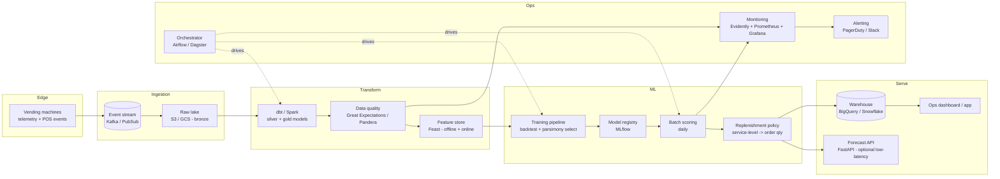

# Production architecture

This document describes how `coffee-intel` would run as a data product for a
**fleet** of coffee machines, not just the single machine in this dataset.

---

## 1. What the product delivers

| Consumer | Output | Cadence | Channel |
|---|---|---|---|
| Field ops / route planner | Per-machine, per-product order-up-to quantities | Daily (or per route visit) | Table in an ops app / BI dashboard, or API |
| Supply chain | Aggregated demand forecast per DC / region | Weekly | Data warehouse table |
| DS / MLOps | Backtest metrics, drift reports, data-quality reports | Every run | MLflow + monitoring dashboards |

---

## 2. Component view

---

## 3. Pipeline stages (mapping to this repo)

| Repo module | Production equivalent |
|---|---|
| `data/ingest.py` | Streaming ingestion + bronze/silver dbt models |
| `data/validate.py` | Great Expectations / Pandera suite, blocking in CI and in the DAG |
| `data/clean.py` | Silver dbt model with tested transformations |
| `features/` | Feature definitions registered in a feature store (offline for training, online for the API) |
| `models/backtest.py` | Scheduled training job; metrics logged to MLflow; `select_model` = automated promotion gate |
| `models/forecaster.py` | Versioned model artifact in the registry |
| `policy/replenishment.py` | Deterministic post-processing service (pure function, unit-tested, no retraining) |
| `pipelines/*` | Airflow/Dagster DAGs, one task per stage, idempotent and backfillable |
| `reporting/` | Scheduled report job feeding the BI layer |

---

## 4. Scalability

- **Data volume**: transaction volume is tiny per machine (~10/day). A fleet of
  10k machines is ~100k events/day — still small. The panel is
  `machines x products x days`; partition by machine and date. Spark only becomes
  necessary at very large fleets; until then a single job on a scheduled
  container is enough.
- **Model**: one **global** LightGBM across all machines/products, with machine
  and location attributes as features. This is what makes ML worthwhile at fleet
  scale — cross-machine pooling lets a new or low-traffic machine borrow strength
  from similar ones. Training stays minutes, not hours.
- **Scoring**: embarrassingly parallel across machines; batch is the default,
  the API is only for on-demand what-if queries.
- **Cost control**: retrain weekly (not daily) unless drift triggers it; score
  daily; cache features.

## 5. Observability

- **Data quality**: every run emits `data_quality.json` (already implemented);
  in production this is a blocking Great Expectations checkpoint with results in
  the monitoring store.
- **Forecast monitoring**: track rolling WAPE/bias per machine and per product
  vs. the seasonal-naive baseline. Alert when the model stops beating the
  baseline, or bias drifts (systematic over/under-stock).
- **Data drift**: Evidently report on feature distributions (price, volume mix,
  weekday pattern) train vs. serving.
- **Business KPIs**: stockout rate (machine reports empty), estimated lost
  sales, waste (expired product), inventory turns. These close the loop on
  whether the model is helping.
- **Ops telemetry**: DAG success/latency, model staleness, freshness SLAs, all
  in Grafana with PagerDuty alerts.

## 6. Maintenance & governance

- **CI/CD**: lint + tests on PR (this repo), image build, deploy on merge;
  model promotion gated by the backtest comparison, not by hand.
- **Reproducibility**: every run pinned to a config version + data snapshot +
  model version; artifacts addressable in the registry.
- **Retraining policy**: scheduled weekly + triggered on drift/KPI breach;
  always shadow-evaluated against the incumbent before promotion.
- **Rollback**: previous model version stays in the registry; policy layer is
  independent so it can fall back to seasonal-naive instantly.

---

## 7. Rollout plan

1. **Phase 0 — shadow**: run the pipeline, publish forecasts and recommended
   orders, but keep humans deciding. Measure WAPE and would-be stockout/waste.
2. **Phase 1 — assist**: recommendations shown in the ops app; planners accept or
   override; capture overrides as feedback.
3. **Phase 2 — auto with guardrails**: auto-generate orders within min/max bounds
   for high-confidence machines; exceptions routed to humans.
4. **Phase 3 — fleet ML**: switch the shipped model from seasonal-naive to the
   global LightGBM once it beats the baseline fleet-wide by the parsimony margin.

---

## 8. Evolutions / next steps

- **Exogenous signals**: weather, local events, building occupancy, school
  calendar, promotions — the features most likely to make ML beat the baseline.
- **Intermittent-demand models** (Croston, TSB) as extra baselines for
  low-volume products.
- **Probabilistic forecasts** (quantile LightGBM) to feed the safety stock
  directly instead of a normal approximation.
- **Price/assortment optimisation**: once repricing is deliberate and logged, an
  uplift/elasticity model on top of the demand model.
- **Joint route + inventory optimisation**: turn per-machine order quantities
  into an optimised refill schedule for the field team.

---

## 9. Key risks

| Risk | Mitigation |
|---|---|
| Model never beats seasonal-naive on single low-volume machines | Ship the baseline; parsimony rule already encodes this; ML reserved for fleet scale |
| Cold start for new machines | Global model + location features; fall back to category average |
| Repricing / menu changes break lag features | Price-relative feature + drift alerts + retrain trigger |
| Telemetry gaps (machine offline) | Data-quality checks flag coverage; impute or exclude, never silently zero-fill a real outage |
| Over-stocking from a too-high service level | Service level is a config knob per product class; tune against measured waste |
